# LoadTree by World_Hello

**Team:** Seow Jiun Wen and Low Jia Qing  
**Problem Statement:** Stress and Workload Manager  
**Video Presentation:** https://youtu.be/lv28DyB8EhE   
**Presentation Slides:** https://canva.link/3oxzu65p7bhryc9

## 1. Project Overview

### The Problem

Students balance coursework, classes, part-time work, social plans, errands, and recovery. They often accept another task because each item looks manageable on its own. However, they may not see how much they are already carrying or how long the new work will take.

Students often underestimate a task's workload. This means they expect the task to require less time and effort than it actually does. A 2022 study of 210 college students found that 47.1% underestimated how long their chosen academic task would take (Brady, Wolters and Yu, 2022). This can cause students to accept too many tasks and realise that their schedule is overloaded only when they are already exhausted.

The main users are university and college students who manage academic work together with jobs, clubs, family duties, social commitments, or errands. Other stakeholders include group members, lecturers, employers, friends, family, and university wellbeing teams.

### Existing Solutions and the Gap

Google Calendar helps users create events and tasks, assign dates, and plan time. Notion provides task databases, while Notion AI can summarise content and extract action items. These tools are useful for organising work, but their standard workflows do not combine a student's load across five areas, estimate the work hidden inside a vague task, and present several schedule changes with clear trade-offs.

### Our Solution

LoadTree is a mobile app that accepts a quick, unstructured message from the user. It turns the message into an editable task roadmap, breaks the work into smaller steps, and estimates the time needed for each step. A rules-based planner checks the task against the student's schedule and protected recovery time.

If the task would cause overload, LoadTree presents three or four possible adjustments when feasible, explains the trade-off of each option, and lets the student choose before the calendar changes.

### Feature Set

- Low-effort dump input for tasks and commitments.
- AI-assisted task breakdown with editable time estimates.
- A visual tree that shows mental, time, physical, social, and errands load.
- An internal calendar that shows current work and proposed changes.
- Overload detection based on schedule constraints and estimated work.
- Several rebalancing options with clear benefits, costs, and a preview before approval.
- Local saving, progress updates, undo, and a manual path when AI is unavailable.

## 2. Ideation and Process

### 2.1 Ideas We Considered

Chosen ideas are listed first. The table shows how the concept changed as we tested its value and feasibility.

| Idea | Why it was kept or dropped |
|---|---|
| **Five-area LoadTree visualisation (Chosen)** | Kept because it gives students one clear view of mental, time, physical, social, and errands load. |
| **Optional dump input (Chosen)** | Kept because users can record a task in their own words with little effort. The system then turns it into structured information. |
| **Editable calendar (Chosen)** | Kept so users can accept a suggested plan or directly change the calendar themselves. |
| **Task roadmap with estimates (Chosen)** | Kept after mentor feedback. The system breaks a task into ordered subtasks and estimates the workload for each one. |
| **Rebalancing options with trade-offs (Chosen)** | Kept because students can compare several realistic changes and choose the option that matches their priorities. |
| Required daily questions | Dropped because daily check-ins could feel like another task and make users avoid the app. |
| AI completes parts of the student's work | Dropped because handling emails, documentation, and research would require much more time and resources. Mentor feedback also showed that a roadmap was enough for the MVP. |
| Automatic rebalancing without approval | Dropped because the system would make decisions without fully knowing the student's priorities. This could reduce trust and make students less willing to follow the plan. |

### 2.2 Ideation Boards

These diagrams show how the idea developed, what causes student overload, and how the current application guides a task from input to an approved plan.

#### Application Evolution

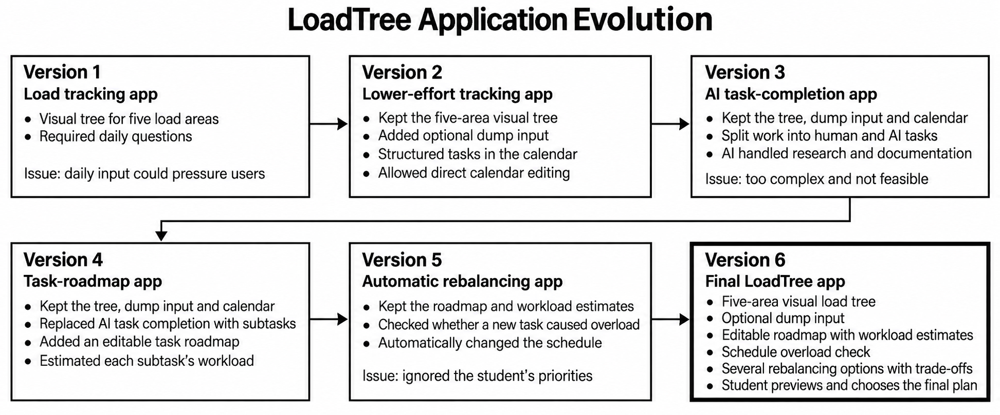

*Figure 1. Application evolution from daily check-ins to the final student-controlled LoadTree concept.*

#### LoadTree Mind Map

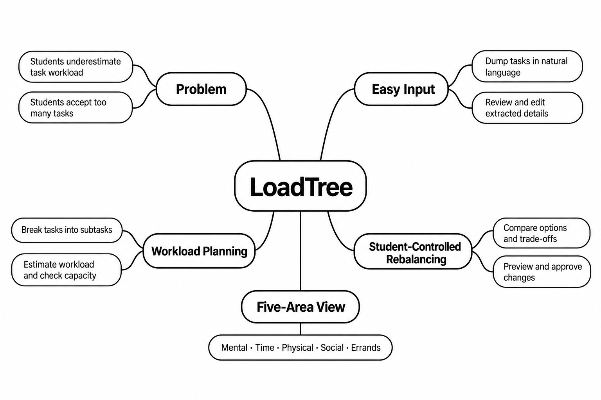

*Figure 2. Mind map of the problem and the main parts of the current LoadTree solution.*

#### Student Workload Problem Tree

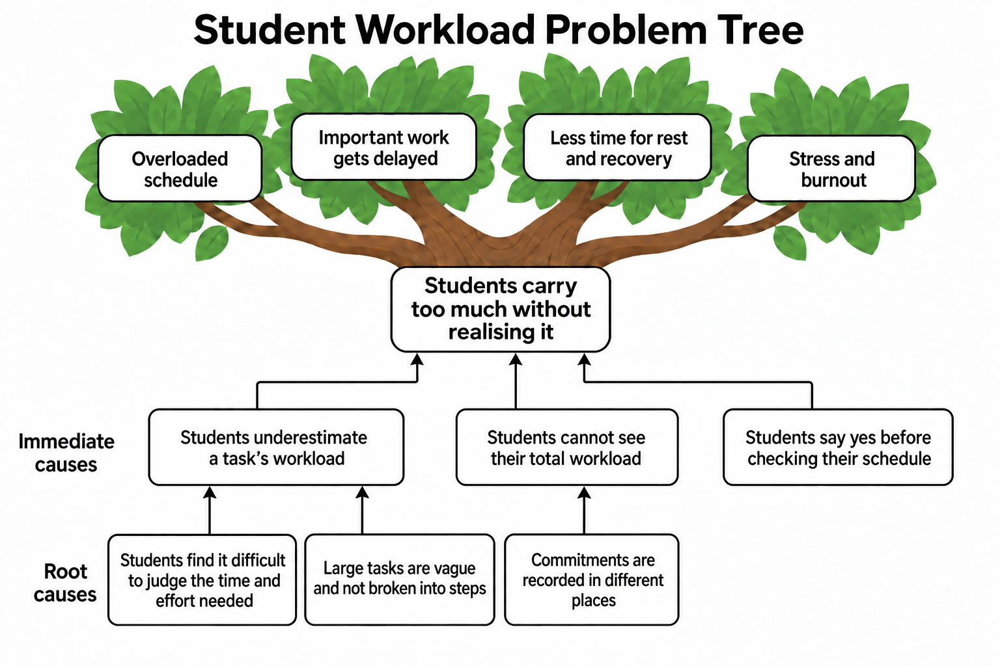

*Figure 3. Problem tree connecting root causes and immediate causes to student overload and burnout effects.*

#### Task Planning Flow

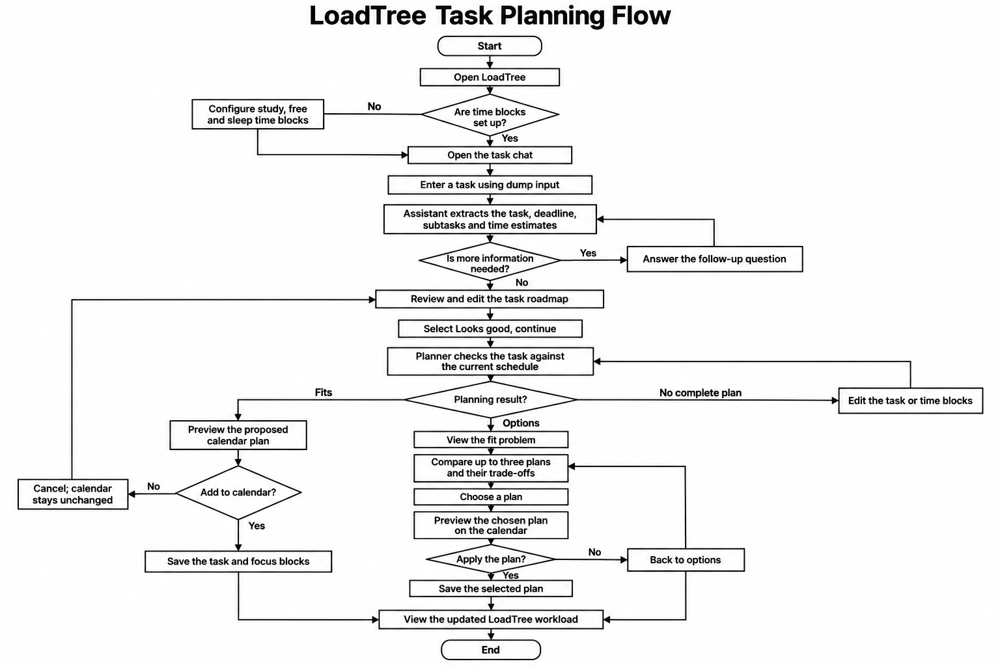

*Figure 4. User flow from task input and workload checking to calendar approval and an updated LoadTree view.*

### 2.3 Mentor Consultation

| Date | Mentor | Feedback Received | What Was Changed |
|---|---|---|---|
| 8 September 2026 | Faris Imran | Reduce the scope. Keep task breakdown as a roadmap instead of asking AI to complete emails, documentation, or research. | Removed AI task completion. Kept editable subtasks, time estimates, next steps, and user-approved calendar changes. |

The mentor's feedback guided the scope reduction. The trade-off comparison and progress-update flows were later refinements made by the team.

## 3. Design and Prototype

**UI Prototype:** [Figma](https://www.figma.com/design/6KvOnFCkYjivM3w06tqNJV/Untitled?node-id=0-1&t=NIR9J4Ju7celVYdY-1)

### Key Screens

The six screens below show the main LoadTree experience from workload overview to an approved calendar plan.

| Workload Overview | Time Load Details |
|---|---|
| 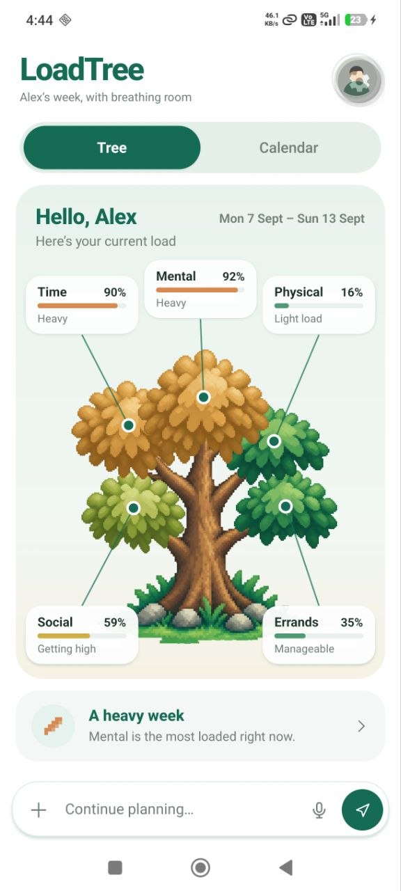 | 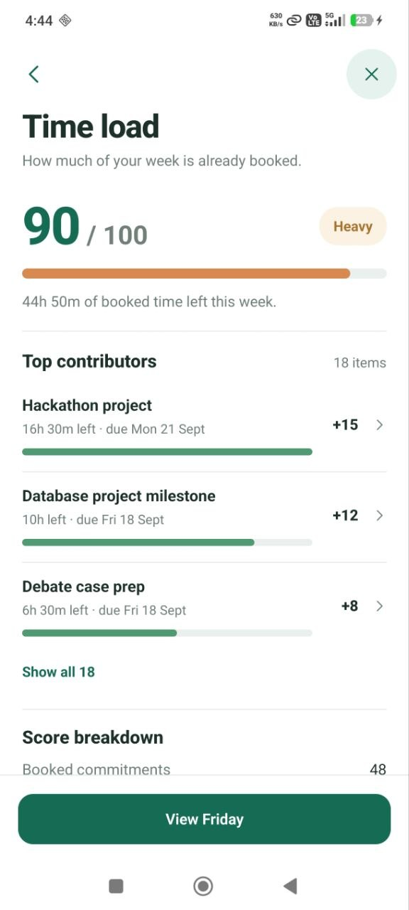 |
| **Screen 1.** LoadTree home: overview of load across five areas. | **Screen 2.** Time load details: score, available time, and top contributors. |

| Dump Input | Task Roadmap |
|---|---|
| 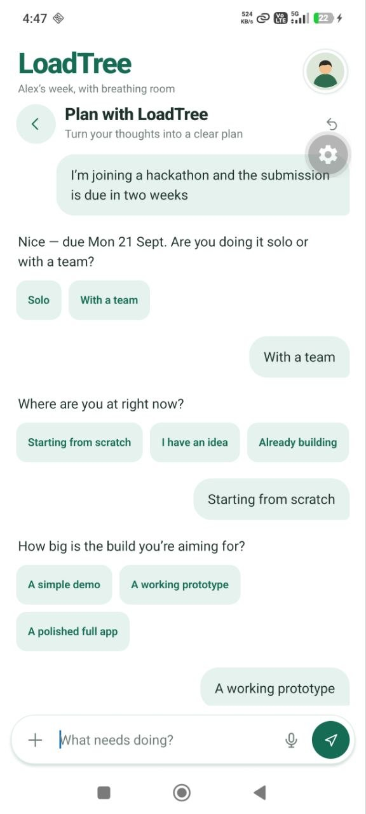 | 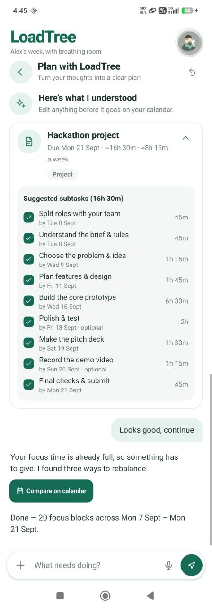 |
| **Screen 3.** Dump input: the student describes a new task in natural language. | **Screen 4.** Task roadmap: extracted subtasks and workload estimates can be reviewed. |

| Rebalancing Options | Calendar Preview |
|---|---|
| 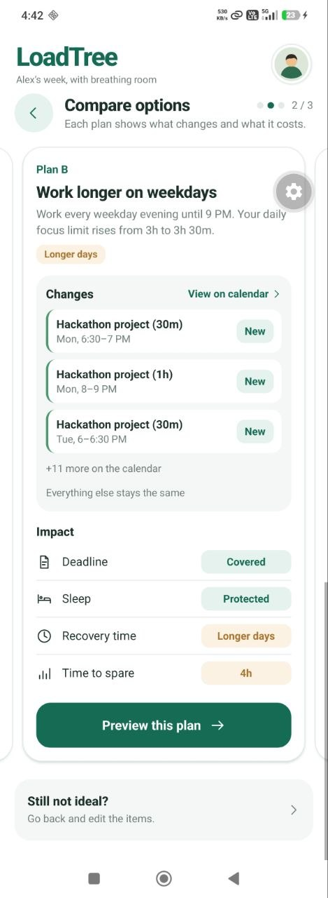 | 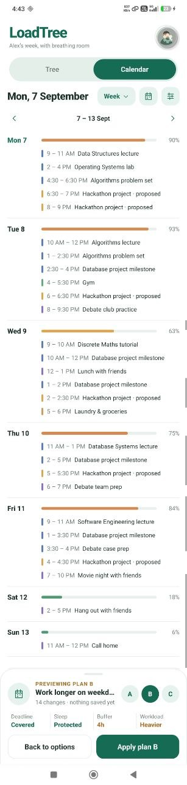 |
| **Screen 5.** Rebalancing options: the student compares changes and trade-offs. | **Screen 6.** Calendar preview: proposed focus blocks appear before the plan is applied. |

## 4. What Makes It Different

LoadTree combines three functions in one student-focused flow. The comparison below is based on the standard features described in the official Google Calendar and Notion help pages.

| Area | Google Calendar | Notion AI and Calendar | LoadTree |
|---|---|---|---|
| Low-effort input | Users create a task or event and enter its details. | Notion AI can extract action items from page content. | The student can dump a short message. LoadTree structures it and prepares it for planning. |
| Task breakdown and workload estimate | Tasks can include a date and planned time, but the user defines the work. | AI can summarise and extract tasks, but workload estimates are not tied to the student's total load by default. | LoadTree breaks the task into editable subtasks and estimates the time for each one. |
| Rebalancing and trade-offs | Users can manually move tasks and events. | Users can manage and move calendar items. | LoadTree generates several feasible options, shows the cost of each option, and asks the student to choose. |

## 5. Technical Architecture and Feasibility

### Tech Stack

The current repository already contains a working mobile prototype and rule-based planning logic. The build phase will connect the prepared AI service to a live deployment and replace demo limits with production-ready data and dates.

| Layer | Choice | Why we chose it | Constraint |
|---|---|---|---|
| Frontend | React Native 0.86, React 19, Expo 57 | One codebase can run on Android, iOS, and the web. Expo reduces setup time for a two-person team. | Keep the MVP focused on the tested mobile flow and limit platform-specific features. |
| Language and UI | TypeScript 6 and react-native-svg | Typed task and schedule models reduce errors. SVG supports the LoadTree visual. | Complex animations and custom graphics must still perform well on lower-end phones. |
| State and local data | React state and AsyncStorage | The prototype works offline and saves the schedule, chat, progress, and setup on the device. | Local storage does not provide account sync or shared data across devices. |
| Planning engine | Deterministic TypeScript rules | The app checks deadlines, fixed commitments, available windows, daily limits, and recovery blocks. Results are explainable and testable. | The MVP will use a small set of planning strategies, not a general optimisation system. |
| Backend and AI | Supabase Edge Function on Deno with Gemini 2.5 Flash | The API key stays on the server. Gemini returns a structured task and two to five estimated steps; the app validates the response before use. | AI estimates may be wrong. Users must be able to edit them, and the local parser remains a fallback. |
| Database and accounts | AsyncStorage for the MVP; Supabase Postgres and Auth if sync is added | A local-first MVP is faster to build and keeps the judging demo reliable. Supabase can later support secure account sync. | Cloud storage requires row-level security, privacy controls, and a clear deletion path. |
| Hosting and delivery | Expo Go or an Android build for mobile; Supabase for the Edge Function; optional Expo web export on Vercel | Reviewers can test the mobile flow while the AI request is handled by a managed backend. | Public links, environment variables, API limits, and mobile network failures must be tested before submission. |

### System Architecture Diagram

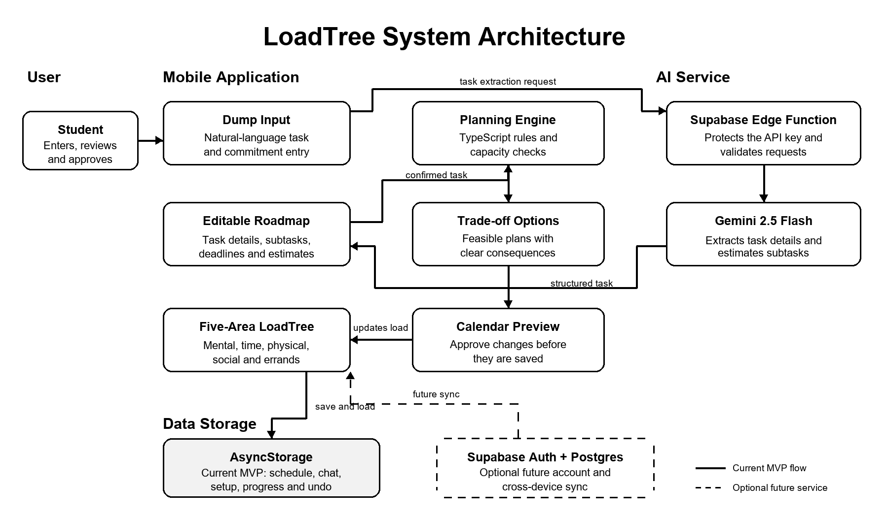

*Figure 5. LoadTree's current mobile, planning, AI, and local-storage architecture. The dashed connection shows the optional future account and cloud-sync service.*

### Current Feasibility Evidence

- The repository contains the complete LoadTree interface, task input flow, calendar views, load calculations, planning rules, trade-off options, preview, approval, progress updates, persistence, undo, and error handling.
- A Supabase Edge Function and mobile client are already prepared for Gemini-based task extraction. The remaining work is deployment, secret configuration, live testing, and prompt refinement.
- Automated tests cover load scoring, planning, conflict handling, calendar dates, setup, persistence, undo, and the main user flows. The current test suite passes.

### Build Plan and Scope

| Priority | What we will build |
|---|---|
| 1. Live AI connection | Deploy the Supabase Edge Function, configure Gemini securely, and test task extraction with real student inputs. |
| 2. Editable AI review | Let the student correct the task title, deadline, subtasks, and estimates before planning starts. |
| 3. Real calendar horizon | Replace the fixed demo week with the current date and a rolling planning period while keeping the same tested planning rules. |
| 4. End-to-end overload flow | Connect accepted tasks to the capacity check, three or four rebalancing options when feasible, trade-off comparison, calendar preview, approval, and undo. |
| 5. Reliability and accessibility | Add loading, timeout, and offline states; test readable text, touch targets, colour-independent labels, and reduced motion on mobile. |
| 6. Demo and deployment | Prepare one complete student scenario, capture the required screens, build the public prototype, and test every link in an incognito window. |

### MVP Boundaries

- The AI will structure tasks and estimate effort. It will not complete assignments, send emails, or perform research for the student.
- The planner will suggest changes. It will not change the calendar without the student's approval.
- The MVP will use the internal calendar and local storage. Full Google or Apple Calendar sync is outside the first build unless the core flow is stable early.
- Load scores are planning indicators based on entered information. They are not a medical diagnosis or a prediction of mental health.

## References

- Brady, A. C., Wolters, C. A., and Yu, S. L. (2022). *Self-regulation of time: The importance of time estimation accuracy*. Frontiers in Psychology, 13, 925812. [https://doi.org/10.3389/fpsyg.2022.925812](https://doi.org/10.3389/fpsyg.2022.925812)
- Google Calendar Help. *Create and manage tasks in Google Calendar*.
- Notion Help Center. *Notion AI for databases*.
- Notion Help Center. *Manage calendars and events in Notion Calendar*.
