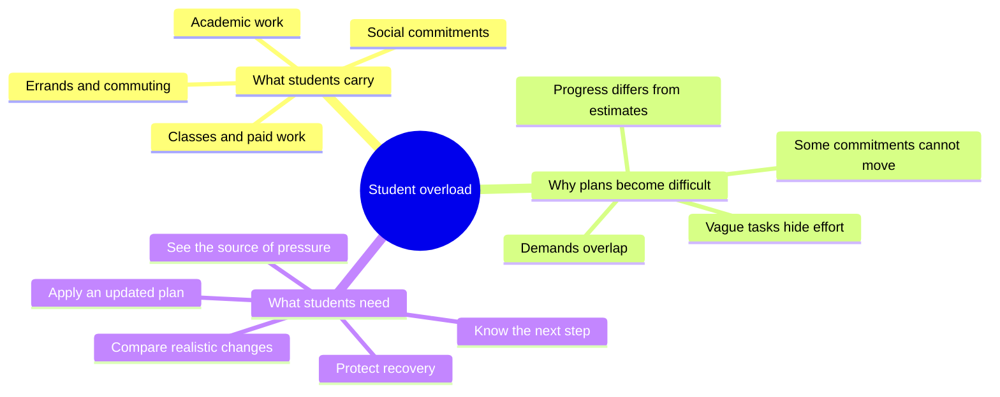
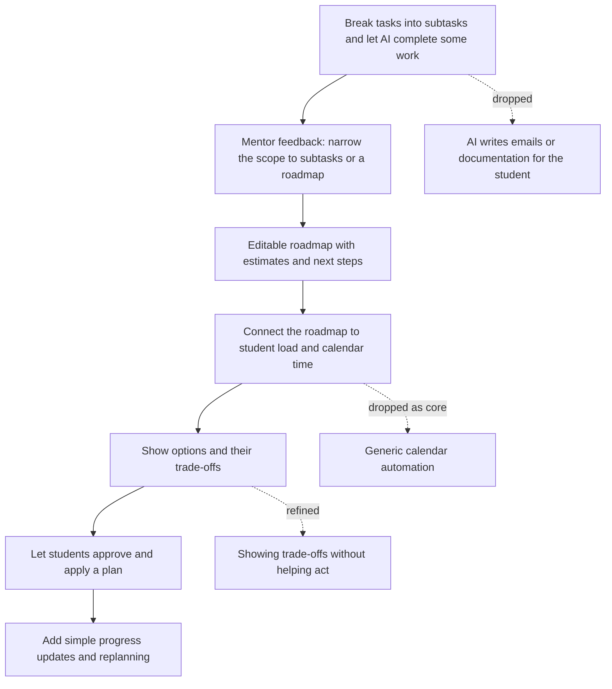
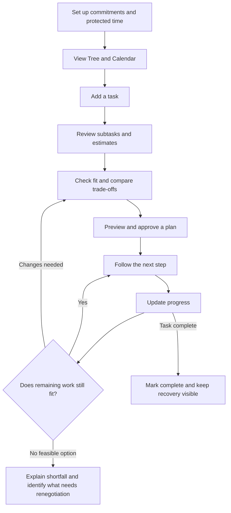
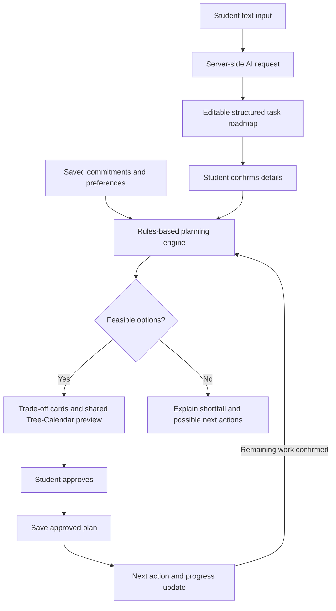

# LoadTree by World_Hello

> See what you are carrying, compare realistic changes, and turn your choice into a manageable plan.

**Team Name:** World_Hello  
**Team:** Seow Jiun Wen and Low Jia Qing  
**Problem Statement:** Stress & Workload Manager  
**Video Presentation:** TODO - add the unlisted YouTube link  
**Presentation Slides:** TODO - add the public slides link

**Project Stage:** Prototype concept. The features and architecture below describe our planned hackathon MVP; they are not claims of a completed application.

## 1. Project Overview

### The Problem

University students balance assignments, classes, part-time jobs, social commitments, errands, and recovery. Each commitment may look manageable on its own, while their combined demands leave little room for unexpected changes. Vague tasks such as "finish my report" also hide the smaller steps and time needed to complete them.

When students fall behind, knowing they are overloaded does not tell them what to do next. They must work out what remains, which commitments can move, and what they would sacrifice with each choice. Rebuilding a plan becomes another task when they are already stretched.

Our primary users are university students balancing academic and personal responsibilities, particularly those with part-time jobs or recurring obligations. Other stakeholders include group-project teammates, lecturers, employers, friends, family, and university wellbeing services.

### Existing Solutions and the Gap

[Reclaim](https://help.reclaim.ai/en/articles/15280604-reclaim-2-0-faq) already offers AI-assisted scheduling, preview-and-approve changes, routines, and overload protection. [Sunsama](https://www.sunsama.com/features/timeboxing) helps users preview tasks against available time and their preferred shutdown time. Scheduling, previews, and recovery-related boundaries are therefore not unique on their own.

Our proposed focus is a student workflow that connects five areas of load with an editable task roadmap, explicit trade-offs, and an approved plan that can be adjusted after a setback. We aim to make the next practical action clear while accounting for student-defined demands and protected time. This is our intended differentiation, not a claim that existing tools lack every individual feature.

### Our Solution

LoadTree is a mobile planner that helps university students understand and rebalance their workload across mental, time, physical, social, and errands demands. It turns a vague task into a short, editable roadmap and checks how the work fits around existing commitments and protected recovery time. When a plan becomes crowded or the student falls behind, it proposes feasible changes and explains the trade-off of each option. The student chooses and approves a plan, and LoadTree updates the calendar and shows the next concrete step.

### Feature Set

| Feature | What it does |
|---|---|
| Simple weekly setup | Records recurring classes, shifts, existing tasks, available study time, and protected rest; distinguishes fixed and flexible commitments. |
| LoadTree visualisation | Shows the five areas of load and the commitments contributing to them. |
| Text capture and task roadmap | Converts a task into a few editable subtasks, estimates, and an order of work. |
| Capacity Checkpoint | Checks whether new or remaining work fits the student's constraints before calendar changes are saved. |
| Trade-off comparison | Explains what each feasible option changes, what it preserves, and what the student gives up. |
| Calendar preview and approval | Shows tentative work blocks and proposed moves before the student applies them. |
| Next-action card | Identifies the next concrete subtask so the student knows where to start. |
| Progress update and replanning | Uses a brief student-confirmed update to adjust remaining work and offer a revised plan when needed. |
| Recovery protection | Keeps student-selected rest periods visible and protected during planning. |
| No-fit explanation | Identifies unresolved work when no schedule fits and helps the student identify what needs renegotiation. |

### Intended Impact

The immediate benefit is a clearer next step and less manual work rebuilding a disrupted week. A student should be able to identify the source of pressure, understand the consequences of a change, and apply a realistic adjustment while keeping important commitments visible.

We plan to test the prototype with a small group of students and observe whether they can understand the load view, correct estimates, compare options, and complete a replanning flow. We would also ask whether the suggested plan feels workable and record the effort needed to maintain it. These are planned evaluations, not completed findings or evidence of reduced burnout.

The same workflow could later support students across different universities through reusable timetable patterns and personal preferences. Our initial scope remains an individual student planner.

## 2. Ideation & Process

### 2.1 Ideas We Considered

Chosen directions are listed first. This table records our concept exploration and scope decisions.

| Idea | Decision and rationale |
|---|---|
| **Editable task roadmap** | **Chosen.** Break vague work into manageable subtasks and a clear order, while leaving the work itself with the student. |
| **Load visualisation with practical rebalancing** | **Chosen.** Connect the five areas of student load to changes the student can actually make. |
| **Trade-off comparison followed by approval** | **Chosen.** Help students choose an acceptable option and apply the corresponding calendar changes. |
| **Lightweight progress updates and replanning** | **Chosen.** Make the planner useful when real progress differs from the original estimate. |
| **Capacity check before accepting a commitment** | **Kept within the same flow.** Preview an optional commitment before adding it; also support required tasks that cannot simply be declined. |
| AI completes selected subtasks, such as emails or documentation | Dropped from the MVP after mentor feedback. Doing the work would expand the scope beyond a feasible planning tool. |
| Generic automatic calendar rearranger | Dropped as the core pitch. Scheduling alone does not explain the student-specific value or the consequences of each change. |
| Standalone stress or mood tracker | Dropped as the main solution. Tracking feelings alone does not produce an actionable work plan. |
| Trade-off display without action support | Refined. Showing consequences is only part of the value; the chosen option should lead to an approved, usable plan. |
| Broad tutorial or resource library | Deferred. It would add content and maintenance work beyond the core planning loop. |
| Voice and file capture | Deferred. Text input is enough to demonstrate the complete MVP flow. |

### 2.2 Ideation Boards

#### Problem Map

This map connects the sources of student overload to the practical support our app should provide. It guided us toward planning and action rather than a dashboard alone.

#### Idea Evolution

Our concept narrowed from AI performing work to AI supporting an actionable roadmap. Later refinements connected that roadmap to trade-offs, approved scheduling, and progress updates so the student can respond when a plan changes.

#### Core User Flow

This flow shows both initial planning and the return journey after a setback. Trade-off comparison stays connected to an action the student can approve.

### 2.3 Mentor Consultation

| Date | Mentor | Feedback Received | What Was Changed |
|---|---|---|---|
| 8 September 2026 | Faris Imran | Our original idea was to break a task into subtasks and let the system perform some AI-suitable subtasks, such as writing emails or documentation. Faris suggested that breaking work into subtasks was sufficient and could be presented as a roadmap, making the project more feasible and keeping its scope manageable. | We narrowed the MVP to an editable task roadmap with estimated durations and next steps. We removed automatic completion of emails, documentation, and other student work from the scope. The roadmap now supports workload planning and student-controlled calendar changes. |

The mentor feedback informed the roadmap and scope reduction. The trade-off and progress-update flows are subsequent team refinements, rather than additional advice attributed to the mentor.

## 3. Design & Prototype

**UI Prototype:** TODO - add a publicly accessible prototype link

**Prototype evidence:** TODO - embed or link 4-8 actual screens with interaction captions. Check the prototype and submission links in an incognito window before submission.

### Main Screens

| Screen | Interaction to demonstrate |
|---|---|
| 1. Weekly setup | Add recurring commitments, mark fixed or flexible items, and protect recovery time. |
| 2. Tree home | Inspect the five areas of load and tap a branch to see contributing commitments. |
| 3. Task capture and roadmap | Enter a task, then review and edit its subtasks, deadline, and estimates. |
| 4. Capacity Checkpoint and trade-offs | See what does not fit and compare feasible adjustments with their consequences. |
| 5. Calendar preview | Review tentative blocks and moves; approve or cancel the changes. |
| 6. Today's next step and progress | See what to work on next and choose Done, Partly done, or Not started. |
| 7. Revised plan | Review changed remaining work and approve a suitable adjustment. |
| 8. No-fit explanation | See the shortfall and what constraints or commitments would need renegotiation. |

Tree and Calendar are separate views of the same plan, with visible navigation as well as optional swiping. Proposed blocks use patterns and labels; saved blocks are visually distinct.

### Simple End-to-End Example

A student has a marketing report due Friday.

1. **Set up the week:** Add classes, work shifts, errands, and protected rest.
2. **See the current load:** Inspect the Tree and Calendar to understand existing commitments.
3. **Add the report:** Type "Marketing report due Friday."
4. **Review the roadmap:** Confirm research, outline, drafting, and editing steps with editable estimates.
5. **Check the impact:** LoadTree checks the work against the entered schedule, daily planning limits, task order, and recovery preferences.
6. **Compare trade-offs:** Where feasible, start earlier and make Tuesday busier, or move a flexible errand to Saturday and use its original slot for study. An extension can be explored separately, subject to outside approval.
7. **Approve a plan:** Review the actual calendar changes and apply the chosen option.
8. **Follow the next step:** See a specific action such as "Gather sources for the report."
9. **Update progress:** If some work remains, confirm what is left. LoadTree checks whether replanning is necessary and shows revised trade-offs.
10. **Finish:** Mark the report submitted while keeping protected recovery time in the plan.

**Illustrative repair:** The student confirms 4 hours 30 minutes of remaining work, but their existing report blocks cover only 3 hours 30 minutes. Moving an eligible one-hour errand from Wednesday to an available Saturday slot creates the missing study hour. The preview shows the errand moving, the report work added, and the unchanged recovery block. Redistributing work changes when it happens; it does not make the total work disappear.

### Progress Updates Without Repeated Prompts

The student can tap **Update progress** at any time. When they next open LoadTree after a scheduled work block, an unobtrusive in-app check-in offers:

- **Done:** Mark the subtask complete.
- **Partly done:** Confirm what remains and adjust the estimate if needed.
- **Not started:** Keep the work unfinished and check whether the plan needs changing.

The student can dismiss the check-in. No answer means **unconfirmed**, not failed or complete, and never triggers automatic rescheduling. A daily reminder can be an optional later addition; it is not necessary for the core MVP.

### When Nothing Fits

If no option satisfies the recorded constraints, LoadTree shows the unmet work clearly: for example, "You need one more hour before Friday than your available study time allows."

The student can correct estimates or availability, identify a commitment to renegotiate, or explore a later deadline as a hypothetical plan. LoadTree does not assume an extension has been granted or silently use protected rest. The original deadline remains until the student confirms an approved change. The MVP identifies the next action; it does not write or send emails or complete documentation.

### Accessibility and Trust

- Use labels, icons, and patterns alongside colour.
- Keep navigation visible, text scalable, and controls easy to tap.
- Explain why each change is proposed and provide preview, cancel, and undo.
- Make AI estimates and demand labels editable.
- Label forecasts as estimates based on entered information; allow missing commitments to be added easily.
- Keep fixed commitments and protected recovery intact unless the student explicitly edits those constraints.
- Use supportive language such as "Update progress" rather than assigning blame for missed work.

## 4. What Makes It Different

Our proposed distinction is the combination of student load awareness, a task roadmap, explicit trade-offs, and action after approval. We do not claim that task breakdown, calendar previews, or recovery scheduling are individually new.

1. **A roadmap connected to real constraints.** Subtasks become work blocks checked against classes, shifts, available time, and personal preferences. The student sees both the next action and where it fits.
2. **Trade-offs that lead to changes.** Each option explains the concrete consequence, such as a busier Tuesday or a postponed errand, and can become an approved calendar plan.
3. **Capacity beyond blank calendar slots.** A student can mark a shift as draining and avoid demanding work afterwards, even when that evening appears unoccupied.
4. **A useful return flow after setbacks.** A brief progress update leads to a check of remaining work and, when needed, a revised plan. The student does not need to rebuild the week manually.
5. **An honest no-fit outcome.** When everything cannot fit, the app makes the shortfall and possible renegotiation clear instead of generating a reassuring but impossible schedule.
6. **Recovery remains part of the plan.** Protected time is a declared planning constraint, so the student can see whether an option respects it.

## 5. Technical Architecture & Feasibility

### Proposed Tech Stack

This is a proposed implementation approach for the three-week build phase. Provider selection and deployment details will be confirmed before implementation; no service integration is claimed as complete.

| Layer | Proposed choice | Why this fits the MVP | Constraint to manage |
|---|---|---|---|
| Frontend | React Native, Expo, and TypeScript | A mobile interface for the Tree, roadmap, and internal Calendar. | Keep interactions and platform-specific behaviour limited. |
| Backend | Supabase with a server-side function for AI requests | A small backend for user data and controlled API access. | Keep secrets server-side and validate AI responses. |
| Database and authentication | Supabase Postgres and Auth | Store commitments, subtasks, progress, preferences, and approved plans per user. | Configure access controls and minimise stored personal data. |
| AI API | One structured-output LLM API; provider and model to be confirmed | Suggest subtasks, durations, and structured task details from text. | Set a request budget, handle failures, and always allow manual correction. |
| Planning engine | Deterministic TypeScript rules | Check task order, deadlines, allowed windows, fixed events, planning limits, and protected time. | Use a few planning strategies rather than attempting a general optimisation system. |
| Hosting and distribution | Proposed static web demo on Vercel; application backend on Supabase; Expo for mobile development | Give reviewers an accessible demo while developing the mobile experience. | Verify export compatibility and public access early; deployment is pending. |

### How the Capacity Check Works

The MVP uses transparent planning signals rather than an unexplained combined burnout score:

- **Time:** Compare estimated work with available windows and the student's chosen study limit.
- **Mental and physical demand:** Use editable low, medium, or high demand labels and preferences such as avoiding demanding study after a draining shift.
- **Social and errands:** Show these commitments and their flexibility; social activities may be described by the student as draining, neutral, or restorative.
- **Recovery:** Preserve designated blocks and respect the student's stated preferences.

The five areas are overlapping views. An errand may consume time and physical effort, so category values are not simply added together. A forecast might state "One hour remains unscheduled before Friday" or "This plan exceeds your chosen study limit on Thursday." It does not diagnose burnout or claim to measure mental health.

The planner first searches allowed free windows, then considers eligible flexible commitments. Each candidate must respect task order, deadlines, fixed events, and protected time. It presents up to two or three feasible options when available, with fewer options if constraints allow only one. If none fits, it reports the unresolved shortfall.

### System Architecture

AI helps structure the input. The planning engine checks feasibility, and the student authorises changes. If AI extraction fails, manual task entry keeps the core flow usable.

### Build Plan & Scope

**MVP deliverables:**

- Manual weekly setup with recurring commitments and protected time.
- Text capture and an editable roadmap of approximately 3-5 subtasks.
- Tree and internal Calendar views driven by the same plan data.
- A small set of scheduling and rebalancing strategies with explicit trade-offs.
- Preview, approval, cancellation, and undo for plan changes.
- A next-action card and brief progress updates.
- A no-fit state with a clear explanation.
- One complete demonstrated student scenario and a small usability evaluation.

**Outside the MVP:**

- AI completing student work, writing emails or documentation, or sending messages.
- Full external calendar synchronisation.
- Voice and file ingestion.
- Automatic rescheduling without approval.
- A resource marketplace or broad tutorial library.
- Clinical stress prediction or automatically learned capacity claims.

### Three-Week Build Plan

| Week | Focus and completion target |
|---|---|
| Week 1 | Finalise task data and planning rules; verify one feasible and one impossible schedule; build setup, Tree, and basic Calendar with sample data. |
| Week 2 | Connect text extraction, editable subtasks, trade-off generation, previews, and saving approved plans. |
| Week 3 | Add progress-based replanning, next actions, no-fit explanations, undo, usability checks, and public demo deployment. |

For a two-person team, a proposed split is one workstream for interface and prototype flow and one for data, AI extraction, and planning rules, with integration and evaluation shared. Individual ownership will be agreed by the team. We will keep API use to task capture and explicit edits, rather than repeatedly calling an LLM for calendar calculations. Provider pricing and a spending cap will be checked before enabling requests; manual entry provides a fallback.

### Risks and Mitigations

| Risk | Mitigation |
|---|---|
| AI suggests inaccurate durations or subtasks | Require review, support manual editing, and retain a manual entry path. |
| Existing commitments are missing | Use recurring setup, easy corrections, and a visible reminder that the forecast depends on entered data. |
| Checking progress becomes burdensome | Allow updates anytime; use dismissible in-app check-ins and leave unanswered tasks unconfirmed. |
| A suggested plan breaks a constraint | Validate candidate plans against deadlines, order, fixed events, and protected time before previewing them. |
| No feasible schedule exists | Show unresolved work and possible renegotiation instead of inventing a successful plan. |
| Two-person scope becomes too large | Prioritise the complete core loop and defer additional input formats and integrations. |
| Sensitive student information is stored | Collect only necessary task data, isolate user records, and include deletion controls in the data design. |
